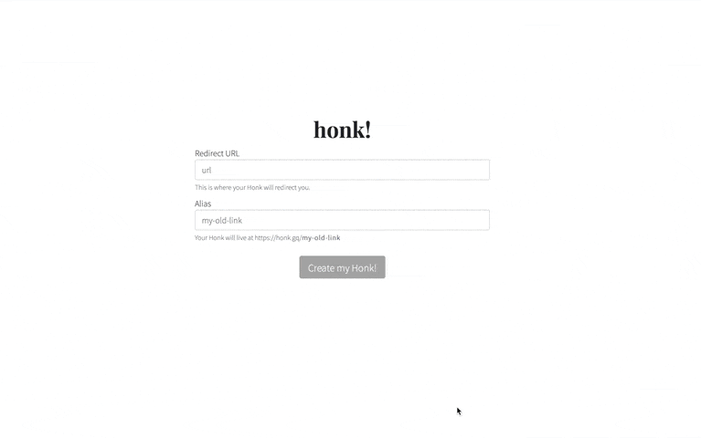

# Honk

Honk is a serverless url shortener written with [create-react-app](https://reactjs.org/docs/create-a-new-react-app.html), [Express](https://expressjs.com), and [MongoDB](http://mongodb.com). It was initially created to make short URL's for personal use.

## Website

The site is live at [https://honk.gq](https://honk.gq)! Feel free to visit and try it out.

## Demo

## Contributing
Pull requests are welcome. For major changes, please open an issue first to discuss what you would like to change. 

To test changes and modify the API, you must create a Netlify account because the Express API runs on Netlify Lambda (for serverless CDN hosting). Please visit [Netlify](https://netlify.com) to create an account, then install the Netlify CLI with `yarn global add netlify-cli`. For more information on installation, see their docs [here](https://docs.netlify.com/cli/get-started/).

After you've installed it, you may start a local development server by running `yarn start` from the project root directory.

## Acknowledgements
Thanks to CJ from [CodingGarden](https://github.com/codinggarden) for the inspiration for this project and for some of the code in the express server.

## License
[MIT](https://choosealicense.com/licenses/mit/)
